# Lurp

Lurp is a Roslyn-based semantic indexer for .NET solutions. It reads a solution
through the compiler, not through text, and stores what it finds (types,
members, call relationships, evidence, exact source spans) in a single SQLite
database. Agents and tools then query that database instead of re-reading and
re-parsing the codebase on every question.

## Why this exists

I couldn't change the model. I could change the data I was feeding it.

Every model I pointed at a real codebase made the same kind of mistake:
confident guesses about code it had only skimmed, dressed up as certainty.
Better prompting didn't fix that. The problem wasn't what the model was being
told to think, it was what it had to think with. Grep and file excerpts give
an agent text. They don't give it what a compiler already knows: which call
actually resolves, which type actually implements which interface, which
change actually reaches which test.

Lurp doesn't try to make a model smarter. It changes its diet: compiler-
verified facts instead of pattern-matched text, each one carrying its own
evidence and provenance, so an agent can tell a proven relationship from a
guess instead of asking you to double-check its work. Not what to think.
How to think with what's actually there.

## Who runs this

Lurp is built to be driven by an agent, not typed by hand. You point your
agent at a solution once. From there the agent is the one issuing
`--mode=context`, `--mode=search`, and `--mode=impact` calls as it works, the
same way it would call any other tool. You'll run `--mode=index` yourself the
first time (or wire it into CI), but the query surface exists for a model to
consume, not for a person to browse.

### What the model sees

A real capsule, not an illustration. This is the `Widget` partial type from
`tests/fixtures/Sample/Library/`, split across `Widget.cs` and
`Widget.Extra.cs`. Every edge below is compiler-derived: `Declares` links the
type to its own members, `Reads` shows a getter's field access. The 23
relationships Lurp couldn't resolve to something in this workspace aren't
dropped silently. They're reported as their own node, reason-coded as
uncertainty instead of masqueraded as "no relationship exists."



## Quick start

```bash
lurp --mode=index --solution=MySolution.sln --output-dir=./out
```

This builds `./out/index.db`: every symbol, edge, and source fact in the
solution, ready to query.

```bash
lurp --mode=context --file=src/Services/OrderService.cs --line=42 --output-dir=./out
```

Assembles a bounded context capsule around that location: the anchor's
contracts, callers, tests, likely change sites, and uncertainties, each with
its own evidence, inside a token budget you control.

## Full reference

Every mode (`index`, `context`, `search`, `impact`, `diff`, `simulate-*`,
`audit`, and the rest), every flag, and the snapshot/migration lifecycle are
documented in [`src/README.md`](src/README.md).

## Project status

[`docs/reference/TRUST_KERNEL.md`](docs/reference/TRUST_KERNEL.md) is the
current, evidence-backed implementation status: what's done, what's
deliberately deferred, and why. [`docs/reference/LURP_ARCHITECTURE.md`](docs/reference/LURP_ARCHITECTURE.md)
is the design document behind it.

## License

MIT. See [`src/LICENSE`](src/LICENSE).
